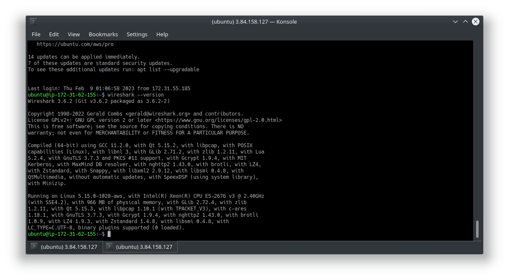

##### This is for Project 11 Jenkins-ansible webhook test 
##### using Bastion server on which Ansible and Jenkins is installed to Automate the installation of wireshark on NFS-SERVER, WEBSERVERS, DATABASE SERVERS, and LOAD BALANCING SERVER then Jenkins will later build the artifacts with the help of github webhooks.
### NB Bastion server connects to the Hosts using SSH-AGENT with their private IPs
### interestingly, this is BANJO BABADE's Project 11 at Darey.io DevOps learning platform

# PROJECT IMAGE 

### Renaming the EC2 instance to Ansible Jenkins

### Creating a new repo in GitHub

### Installing Ansible on the same machine that had Jenkins

### Creating a frestyle project namely 'ansible' on jenkins

### create a webhook on github for the repo in jenkins

###  Testing and checking the build in jenkins

[label](readme.md%0D) [label](IMG-SCREENSHOT/Screenshot_20230205_111351.png%0D) 
 
 ### Created FirstBranch and  Hotfix  Branches of ansible-config-mgt repo in Github 
 [label](readme.md%0D) [label](IMG-SCREENSHOT/Screenshot_20230205_115525.png%0D) 

### created readme.md and working with the FirstBranch Branch from VScode
 

 ### Creating folders and files structures for ansible  

 [label](IMG-SCREENSHOT/Screenshot_20230205_124156.png%0D) [label](IMG-SCREENSHOT/Screenshot_20230206_224624.png%0D) 

### mearge and push changes to master
 

### Github webhooks trioggers a build on jenkins
 

 
 ### confirm the jenkins build on terminal
 

### ansible-playbook error 
 [label](readme.md%0D) [label](IMG-SCREENSHOT/Screenshot_20230207_003129.png%0D) 

 ### one worked, others failed
 

### troubleshooted and made sure other servers were available via ssh-agent 

### MNow confirmed on my WEBSERVER2 that wireshark was installed successfully

### installations on other servers succesfull

### confirm installation on Load Balancer

